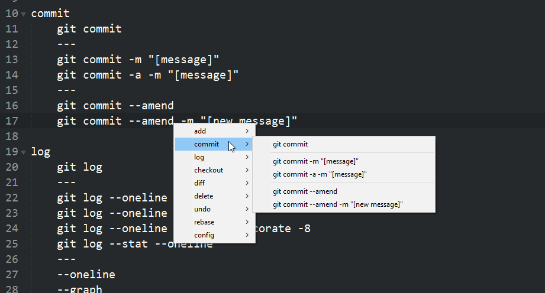

# ezMenu



&nbsp;

## parameters

```
ezMenu("label_name", menu_text)
```

#### label_name:

the name of the label/subroutine that will run when any item in the menu is clicked


#### menu_text:

a string containing menu text or the path of a file that contains menu text  

> run the file [**example.ahk**](example/example.ahk) for some examples of the different methods.

&nbsp;


## syntax

#### sub-menu

```
level 1.1
    level 2.1 sub-menu
    level 2.2
level 1.2
level 1.3
```
any text that is indented by 1 tab or 4 spaces will become a sub-menu.


#### separator  
lines that contain only 3 dashes `---` will become menu separators


#### custom labels  
`item text ! another_label_name`  

if the text after `!` is a valid label name, it will be used instead of the default subroutine and the `!` + label name text will be removed


#### disable an item  
`.item text`  

start the line with a full stop to have the item disabled (greyed out)


#### default item  
`*item text`  

start the line with an asterick to set the item as the default (bold text)


#### comments  
lines with a semi-colon at the start will be ignored.  
*(at the moment its not possible to comment out a parent menu item and have all its sub items ignored)*  

`item text    ; comment explaining the item`

if you want to have comments after an item then use the `item_mod()` function in [example.ahk](example/example.ahk) to strip them out once the item is clicked
